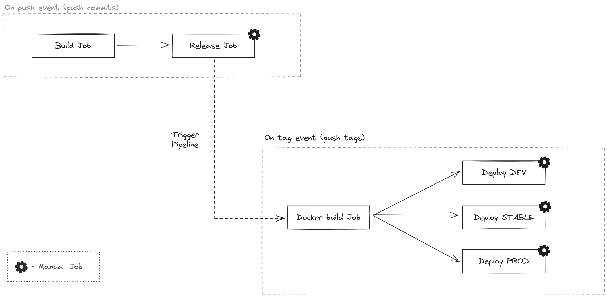

# Git Tag Flow CI/CD

Page describes what is Git Tag Flow and how to use it.

:::info
Read detailed description about GTF [here](https://github.com/vasdee/git-tag-flow)
:::

## Introduction

Various cases in development create situations when it is necessary to quickly upload a fix to the prod branch, 
bypassing the development branch, and then rebase, or use complex options to restore the git branch.

> Git flow is heavy and even considered legacy by some. Heavy in that it requires maintenance of long lived branches and requires strict conventions when performing releases via release branches.
>
> Trunk based develops suggests that your architecture should change in order to facilitate being able to deploy potentially "broken" functionality into production.
>
> GTF takes the simplicity of trunk and applies some of the wisdom from gitflow, enabling GitOps via tags and enabling traceability of actions back to atomic commits. The principle is simple: you should always be able to trace back exactly what you deployed to production, within your git repository. This is not only common sense, but makes replicating production issues locally a less painful process.
> 
> Read more [vasdee/GTF](https://github.com/vasdee/git-tag-flow)

The idea is that we no longer tie the branch to the stand. 
Instead, we create a tag on a specific commit and have the right to 
deploy the version to any stand. We have one development branch and release 
a version that is picked up by CI/CD, lints, builds, tests and creates a docker container, 
which can then be sent to the stand we need, be it dev, stable or prod.

## CI/CD

> Check out [Gitlab CI/CD code](https://github.com/temarusanov/workspace/tree/main/devops/gitlab)

When developing an application, when developers commit their code to any branch, it creates a On-Push-Event pipeline. 
This is where the application is tested: lint, build and test. 
After this, we have the opportunity to manualy release a new version of the application.

Release job creates CHANGELOG and pushes new tags. On these tags triggers new On-Tag-Event Pipeline which build 
docker container and pushes it to Container Registry (ex. Gitlab). After that you can run a manual job to deploy your application. 

:::tip
Use [conventional commits](https://www.conventionalcommits.org/en/v1.0.0/) to properly release your version and make CHANGELOG useful
:::

## Summary

This page requires you to understand how CI/CD works. 
Also, I left a link above to the code in which you can see in more detail how it works.
Let's collect all the advantages of using GTF:
- One main development branch
- Ability to deploy at any time
- Ability to roll back to an older version by deploying a previous release
- Ability to deploy a hotfix for any release version
- Ability to support an infinite number of project stands