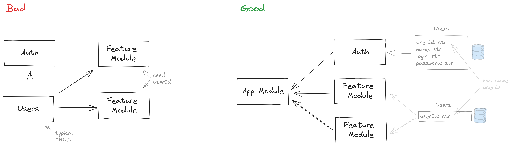
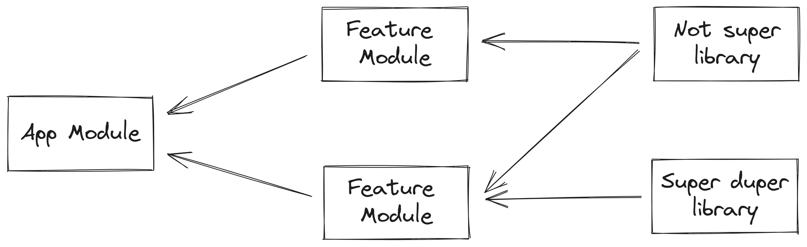
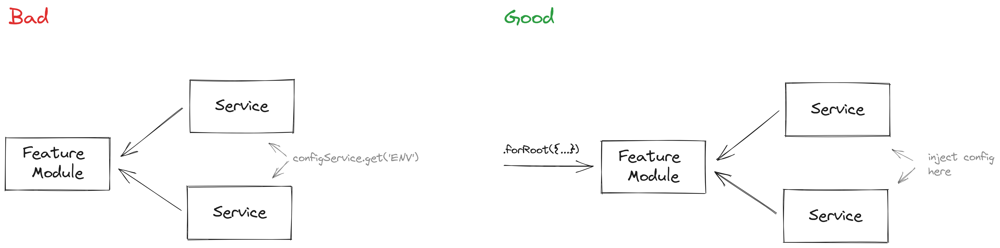

# Module

Page describes what a typical module in a workspace should look like

## Introduction

During the design phase, you need to divide your application logic into modules. 
A typical developer mistake is to describe modules around an entity in a database. 
A bunch of relationships are created between your entities and, accordingly, between modules.
Maintaining spaghetti code becomes problematic

On this page I will share my vision of how the module should look like so that 
it can be easily reused and maintained in different projects.

One of the important properties of a module should be reusability. 
I saw how different teams wrote the same code at different times, 
just because the old code could not be reused. For example, I saw the authorization module depended 
on the notification module, the 2fa module, and the dictionary module. 
And if I needed an authorization module, I had to drag everything else. Sounds terrific, huh?

So, in order to make a module reusable, you need to keep a few rules

## Don't separate modules too deeply. 

If you have a typical authorization and users, it makes sense to 
write an authorization module and implement all the logic, 
rather than creating a separate authorization module 
and a user module that will contain a regular CRUD



In good example, you can see that feature modules don't depend on auth module and have their own Users entity
That allows you to unbind auth module from your feature modules

## Don't link libraries

The library in Nx is what is stored in your `/libs` directory. In our case library is a NestJS module.
It's a good rule of thumb not to link anything in your library.
If you need something in common between your libraries, you can create a separate folder `/libs/common`
and store anything you want here.

```
libs/
  common/                    <---- grouping folder
    super-duper-library/
    not-super-library/
  feature1/                <---- feature library
  feature2/                <---- feature library
```

The same but drawn by a professional artist




## Don't make one database provider

If you have a single database provider for the entire monorepository, 
you will not be able to simply reuse your modules in other projects. 
At least because you will have to delete unnecessary entities in the database.
I advice you to create database provider (like Prisma ORM) for each feature module

Checkout an example [here](https://github.com/temarusanov/workspace/tree/main/libs/sample/src)

## Don't use ConfigModule in services

By using the config module in your services, you bind environment variables to your code. 
Instead, it's better to connect the config dynamically via `.forRoot({...})`



```ts title="app.module.ts"
import { Module } from '@nestjs/common'

@Module({
    imports: [
        FeatureModule.forRoot({
            enableSomething: true,
            destroyPlanet: false
        }),
    ],
    controllers: [],
    providers: [],
})
export class AppModule {}
```

## Link your features in the integration layer

If we can't connect features with each other directly, 
then how can we connect the application logic together? For example, if user registered (AuthModule), 
we need to create a plan for him, the logic of which is implemented in another library (PlanModule).

Link your code in an integration layer. 
An integration layer is additional services that ties your application together.
Let's take a look at our authorization and plans example in more depth.

Let's assume you have an authorization module that has a `signUp()` function. 
And you need to create play when user has registered.
In order to link modules, there are two solutions

### Create an integration function in your config

When writing a module that has its own config, implement the `onSignUp()`function in it 

```ts title="libs/auth/src/lib/configs/module.config.ts"
export const AUTH_CONFIG = 'AUTH_CONFIG'

export interface AuthConfig {
    databaseUrl: { ... }

    onSignUp: (user: User) => Promise<void>
}
```

And then add it to your `signUp()` function in your service

```ts title="libs/auth/src/lib/services/auth.service.ts"
@Injectable()
export class AuthService {
    constructor(
        @Inject(AUTH_CONFIG)
        private readonly config: AuthConfig
    ) {}

    async signUp() {
        // some sign up logic here

        await this.config.onSignUp(user)

        return user
    }
}
```

Then create an intergration service in your application (`/apps/my-application`)

```ts title="apps/my-application/src/lib/integrations/auth.integration.ts"
@Injectable()
export class AuthConfigIntegration implements AuthConfig {
    constructor(
        private readonly planService: PlanService
    )

    async onSignUp(user: User) {
        await this.planService.createPlan(user.userId)
    }
}
```

And inject `AuthConfigIntegration` in your AuthModule `.forRootAsync()` function

:::caution

For now, I don't have `.forRootAsync()` function in my workspace. But you can find docs about that in 
[NestJS](https://docs.nestjs.com/fundamentals/dynamic-modules)

:::

### Publish an event after user has been registered

Add a publish function to your `signUp()` function in your service.
You can use RxJs, NATS, RMQ, Events, etc.

```ts title="libs/auth/src/lib/services/auth.service.ts"
@Injectable()
export class AuthService {
    constructor(
        private readonly authEventService: AuthEventStream
    ) {}

    async signUp() {
        // some sign up logic here

        await this.authEventService.publish({
            pattern: 'USER_REGISTERED',
            data: user
        })

        return user
    }
}
```

Then create an intergration service in your application (`/apps/my-application`)

```ts title="apps/my-application/src/lib/integrations/auth.integration.ts"
@Injectable()
export class AuthConfigIntegration {
    constructor(
        private readonly planService: PlanService,
        private readonly authEventService: AuthEventStream
    )

    async onApplicationBootstrap() {
        this.authEventService.subscribe('USER_REGISTERED', (data) => {
            await this.planService.createPlan(data.userId)
        })
    }
}
```

:::info
This is not a full code. It can depends on what you are using in your project. For example, for NATS
implementation can differ from that, but the approach is the same
:::

## Summary

All of these tips will help keep your modules standardized and reusable. 
Of course, it all depends on your preferences and coding standards. 
Maybe this won't work for you. For a long time I did not understand 
why modules were needed in the NestJS, 
until I realized their main advantage: reusing code and packing logic into modules. 
But in order to achieve this, you will have to learn how to make them independent.

## Source code

:::tip

[Don't trust, verify!](https://github.com/temarusanov/nx/tree/main/libs/sample)

:::

  